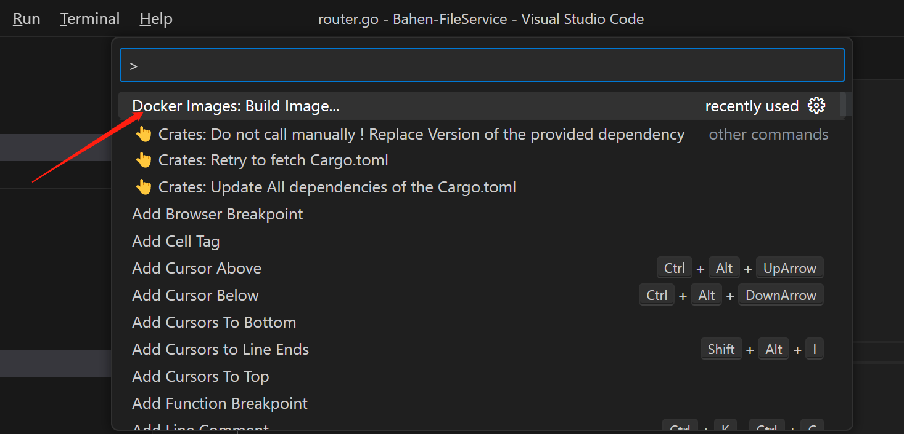
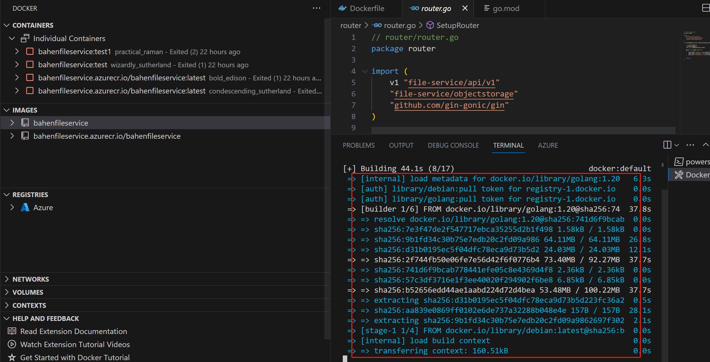
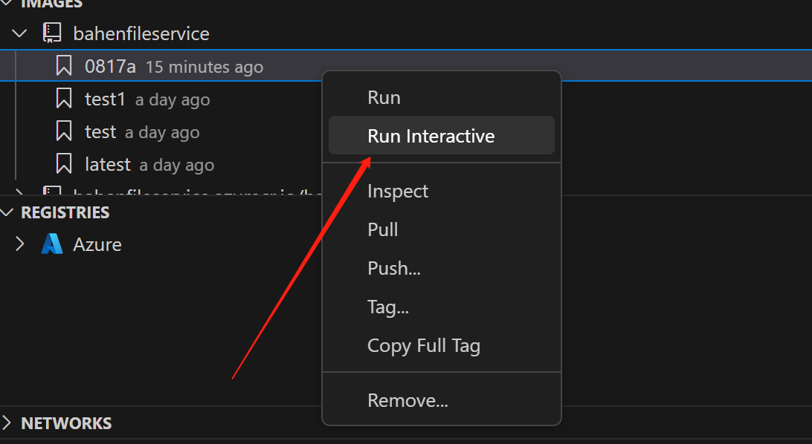
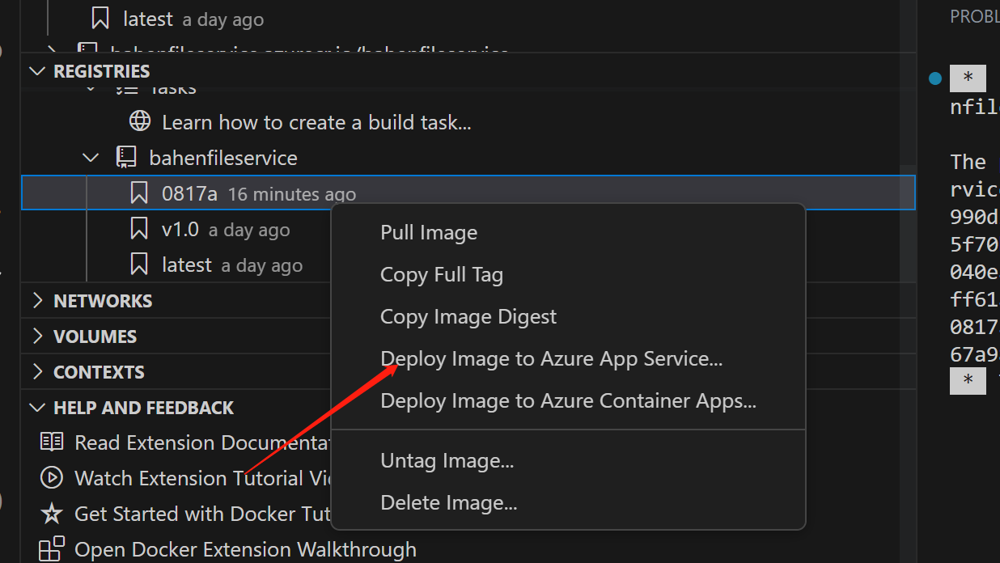
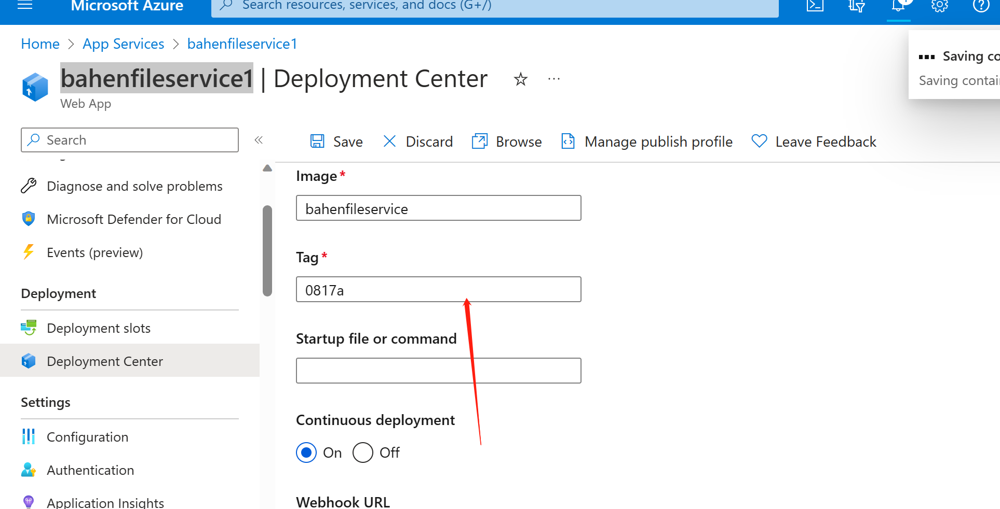

# Decenter-FileService

Welcome! Decenter FileService is a Go-based Web 2.0 service integral to the Decenter project. It serves as a dedicated storage solution for user-uploaded training data, pre-trained models, and the models processed by workers. Our service offers an unparalleled combination of efficiency, security, and transparency.

## 1. Key Features

- **Integration with Greenfield**: 
  Seamlessly upload and download files with complete compatibility and integration for BNB Greenfield.

- **Safety First with AES Encryption**: 
  We prioritize the data's security. All files processed through our service are secured using state-of-the-art AES encryption, ensuring that the data remains confidential and protected against unwanted access.

- **Resumable Downloads**: 
  No need to worry about interrupted transfers. Our service supports resumable downloads, meaning if the download gets interrupted for any reason, it can pick up right where it is left off.

- **Fully Open Source Processing**: 
  To ensure maximum transparency and decentralization, our entire processing workflow is open source. Dive into the code, make improvements, or simply verify the processes – the choice is yours!

## 2. BNB Storage Client Guide

The BNB Storage Client is a Go package providing an interface to interact with the Greenfield storage service on the BNB Chain. With this client, users can manage their storage operations such as creating buckets, uploading objects, downloading objects, and listing stored objects.

### 2.1 Initialization:
To initialize the BNB client, you need a `privateKey`, `chainId`, and `rpcAddr`:

```go
client := storageclient.NewClient(config.PrivateKey, config.ChainId, config.RpcAddr)

app := router.SetupRouter(client)
```

We will initialize BNBclient in main.go and obtain the parameters required to connect to BNB from azure keyvalut in config.go based on the Managed Service Identity credentials: RpcAddr, ChainId, PrivateKey, etc., as well as the PrivateAESKey and other secrets required for encryption


### 2.2 Bucket Operations:
#### Create a Bucket:
To create a new bucket:
```go
txnHash, err := client.CreateBucket(ctx, bucketName)
```
#### Check if Bucket Exists:
```go
exists := client.ExistBucket(ctx, bucketName)
```


### 2.3 Object Operations:
#### Upload an Object:
Before uploading, the client checks if the specified bucket exists and creates it if necessary:
```go
txnHash, err := client.CreateObject(ctx, bucketName, objectName, buffer)
```
#### Download an Object:
Simple object retrieval:
```go
data, err := client.GetObject(ctx, bucketName, objectName)
```

For resumable downloads:
```go
filePath, err := client.GetObjectResumable(ctx, bucketName, objectName, userUniqueID)
```
The `GetObjectResumable` method supports interrupted downloads by checking for existing temporary files and resuming the download.

### 2.4 Cleanup:
Over time, temporary files might accumulate on the system. To regularly clean up old files:
```go
CleanupOldFiles()
```

The `CleanupOldFiles` function scans the `/tmp/` directory and deletes old files based on a specified threshold (default is 24 hours).

#### List Stored Objects:
To list objects in a bucket: ()
```go
objectsList, err := client.ListObjects(ctx, bucketName)
```

For more details, please refer to the provided `bnb_client.go` source file or consult the Greenfield SDK documentation on the BNB Chain.

## 3. Deploy project to azure web app.
### 3.1. Use VSCode docker extensions to build image. (remember your tag)


### 3.2. Wait for the build.


### 3.3. Test to run the image.


### 3.4. If image successfully runs, push it to the registries.


### 3.5.1 Deploy this image by create a new web app.


### 3. 5.2 Deplpoy this image by using existing web app.


